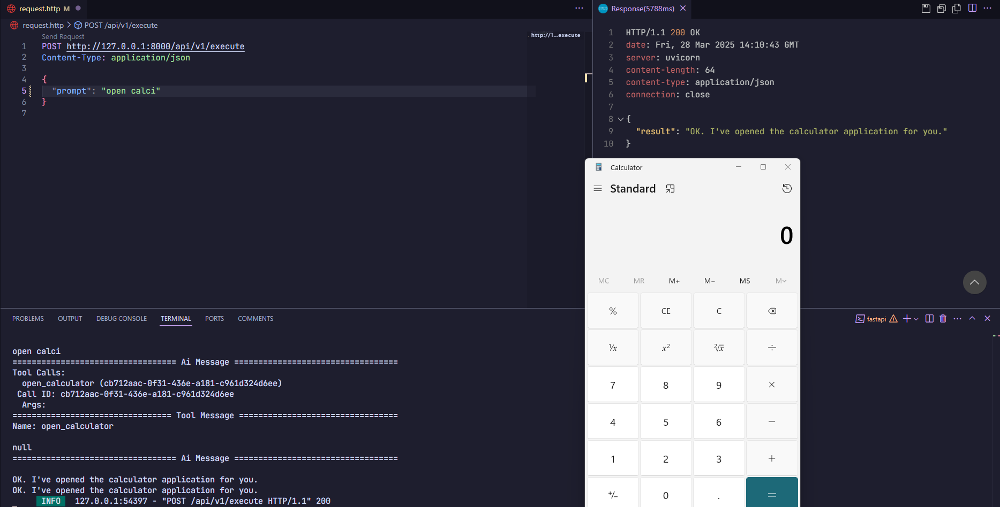
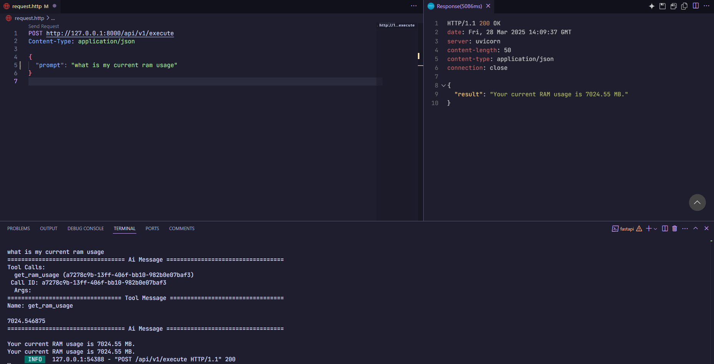

# Function Tools RAG API

A FastAPI backend with LangChain and Google GenAI for retrieving relevant function tools using RAG.

## Setup

1. Copy `.env.example` to `.env` and add your Google GenAI API key:

   ```bash
   cp .env.example .env
   ```

2. Install dependencies:

   ```bash
   pip install -r requirements.txt
   ```

3. Run the application:
   ```bash
   uvicorn app.main:app --reload
   ```

## API Endpoint

- `POST /api/v1/execute`
  - Request body:
    ```json
    {
      "prompt": "Open calculator"
    }
    ```
  - Response:
    ```json
    {
      "result": ["open_calculator"]
    }
    ```

## Project Structure

```
app/
├── main.py                # FastAPI app
├── api/
│   └── v1/
│       └── routes.py      # API endpoints
├── core/
│   ├── config.py          # Configuration
│   ├── tools.py           # Tools
│   └── services.py        # RAG service
├── models/
│   └── schemas.py         # Pydantic models
└── utils/
    └── vector_store.py    # Vector store setup
```

## Features

- Single endpoint for function tool retrieval
- ChromaDB vector store for function tool embeddings
- Google GenAI integration
- Proper FastAPI project structure

## Showcase


_Example of the calculator tool being retrieved_


_Example of ram usage tool being used_
